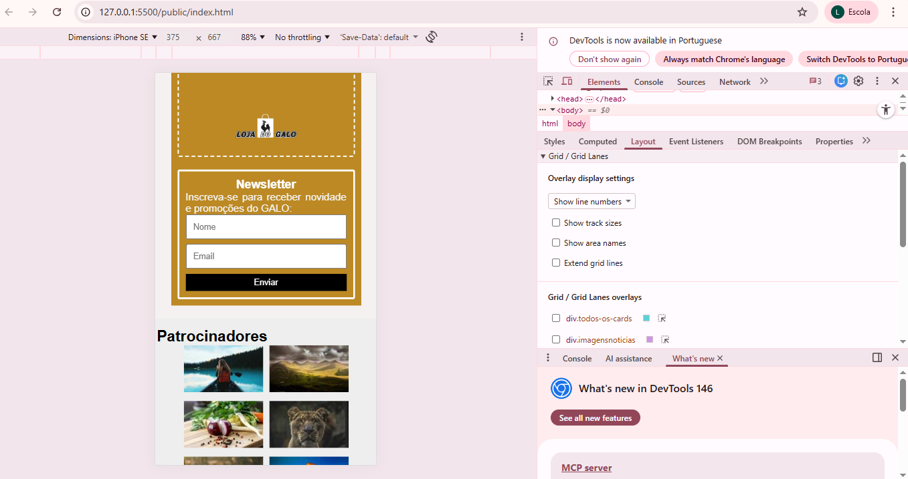
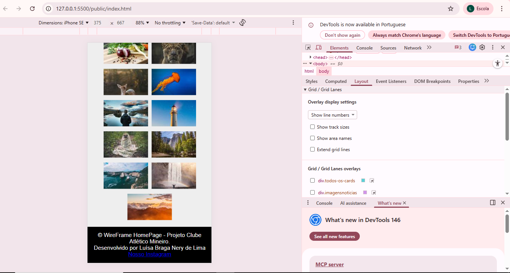

# Trabalho Prático - Semana 04 e 05
## Informações Gerais
SEMANA 05 - Evolução e responsividade da Home-page

Nome: Luísa Braga Nery de Lima
Matrícula: 925424

Proposta de projeto escolhida: Homepage - Clube Atlético Mineiro
Descrição sobre o projeto: Este projeto consiste no desenvolvimento de uma homepage sobre o Clube de futebol Atlético Mineiro, contendo informações como notícias, johistória do clube, vídeos entre outros.

PRINT DESKTOP:

PRINT MOBILE:

