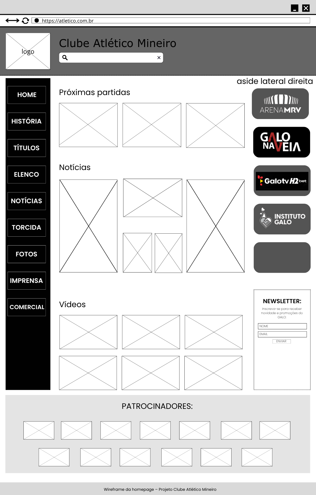
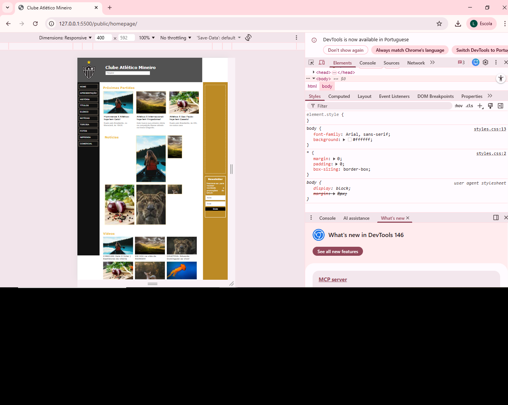
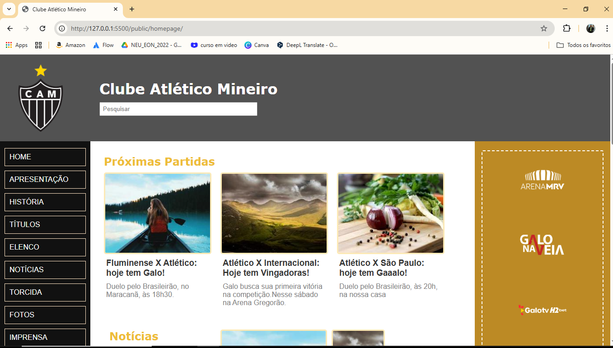

# Trabalho Prático - Semana 04 e 05
## Informações Gerais

Nome: Luísa Braga Nery de Lima
Matrícula: 925424

Proposta de projeto escolhida: Homepage - Clube Atlético Mineiro
Descrição sobre o projeto: Este projeto consiste no desenvolvimento de uma homepage sobre o Clube de futebol Atlético Mineiro, contendo informações como notícias, johistória do clube, vídeos entre outros.

Imagem do esboço (wireframe): 

Print da home-page criada para o projeto:

