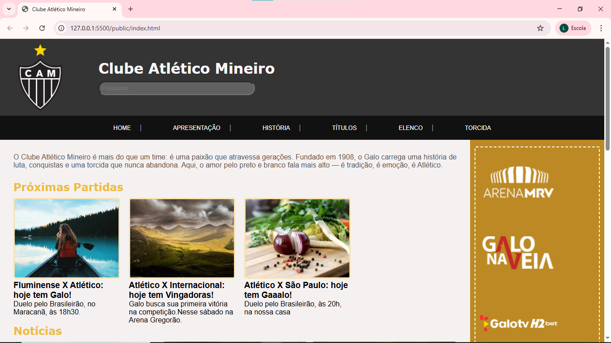
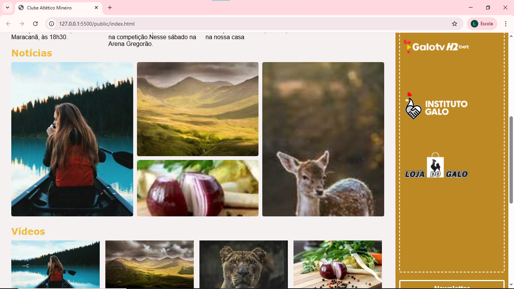
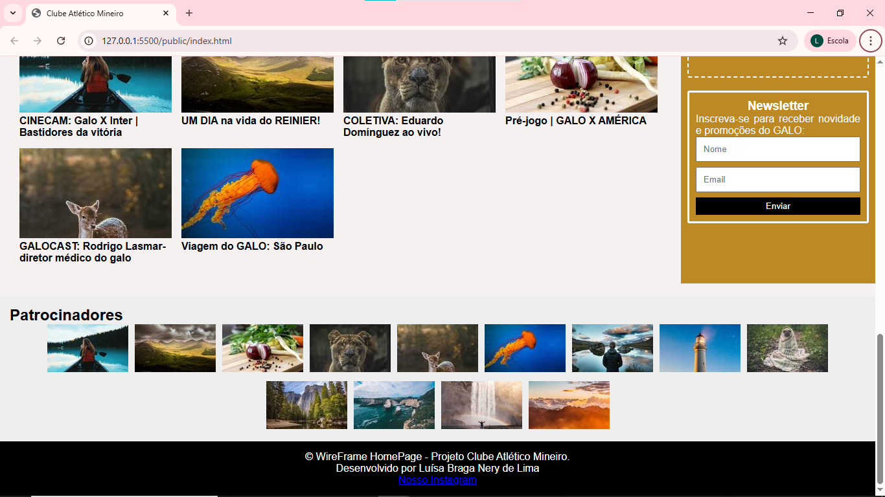
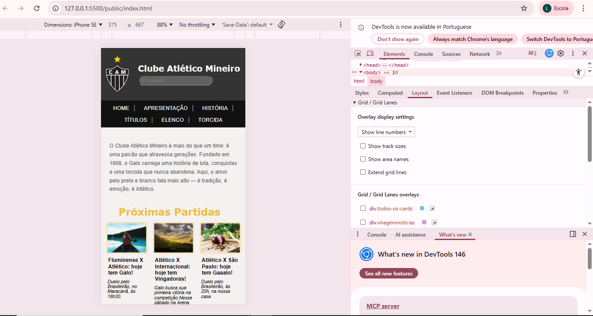
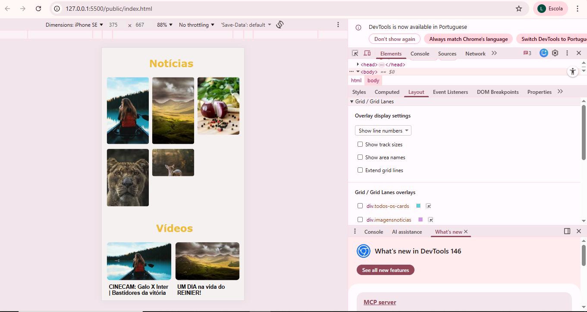
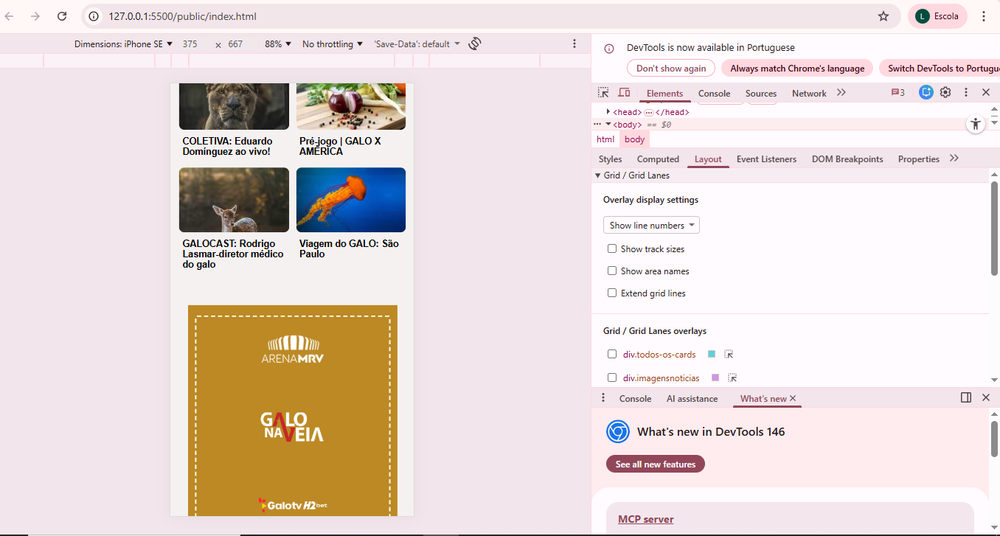

# Trabalho Prático - Semana 04 e 05

Nome: Luísa Braga Nery de Lima
Matrícula: 925424

VERSIONAMENTO Homepage - Clube Atlético Mineiro
Descrição sobre o projeto: Este projeto consiste no desenvolvimento de uma homepage sobre o Clube de futebol Atlético Mineiro, contendo informações como notícias, história do clube, vídeos entre outros.

PRINT VERSÃO DESKOTP

PRINT VERSÃO MOBILE

